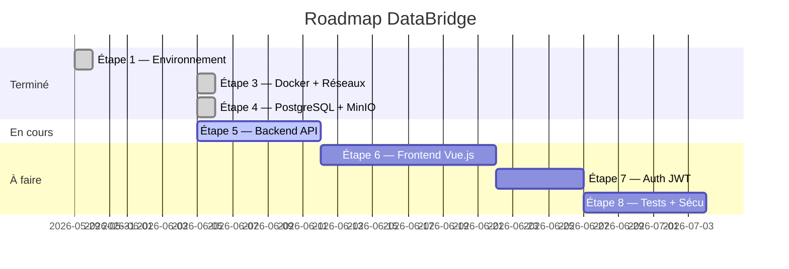
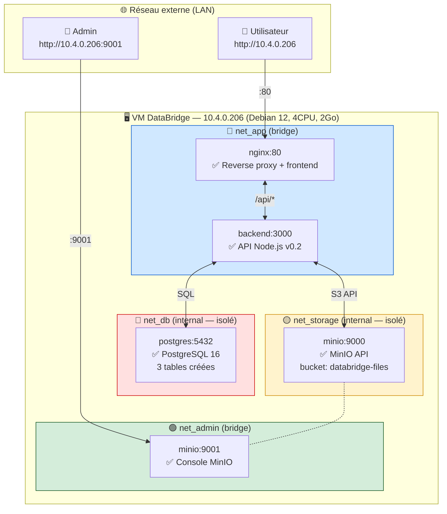
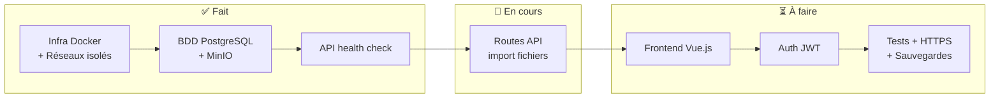

# DataBridge — Todo List & Suivi de projet

> Fichier partagé — modifiable par Yannis, Tommy et Claude Code.
> Cochez `[x]` quand c'est terminé. Ajoutez vos notes dans la section prévue en bas.
> Claude met aussi ce fichier à jour après chaque session de travail.

---

## Statut global

---

## Architecture actuelle (ce qui tourne)

---

## ✅ Ce qui est fait

### Étape 1 — Préparation (2026-05-29)
- [x] Organisation GitHub créée (`infoserv-DataBridge`)
- [x] Repos créés : `DataBridge` + `infra-proxmox`
- [x] VM DataBridge créée sur Proxmox (Debian 12, 10.4.0.206)
- [x] Docker 29.5.2 + Docker Compose v5.1.4 installés
- [x] Structure dossiers sur la VM
- [x] Diagramme infrastructure Excalidraw créé

### Étape 3 — Infrastructure Docker (2026-06-05)
- [x] `docker-compose.yml` avec 5 services (postgres, minio, minio-init, backend, nginx)
- [x] `Dockerfile.backend` (Node.js 20 Alpine)
- [x] `Dockerfile.frontend` (multi-stage Vue.js, prêt pour étape 6)
- [x] `nginx.conf` (reverse proxy `/api/` → backend, `/` → frontend)
- [x] **Segmentation réseau** : 4 réseaux isolés (net_db, net_storage, net_app, net_admin)
  - postgres : accessible UNIQUEMENT par le backend (net_db internal)
  - minio API : accessible UNIQUEMENT par le backend (net_storage internal)
  - minio console : accessible admin via net_admin (port 9001)
  - backend : aucun port exposé vers l'extérieur
  - nginx : seul point d'entrée public (port 80)

### Étape 4 — Base de données & stockage (2026-06-05)
- [x] Schéma PostgreSQL : `users`, `imports`, `import_rows` + index GIN
- [x] Bucket MinIO `databridge-files` créé automatiquement (service minio-init)
- [x] Backend connecté à PostgreSQL et MinIO (`pg` + `minio` npm)
- [x] `GET /api/health` vérifie les 3 services (API + postgres + minio)

### Documentation & infrastructure
- [x] `README.md` : accès VM, roadmap, structure, conventions Git
- [x] `docs/acces.md` : toutes les URLs, ports, commandes Docker
- [x] `docs/setup.md` : installation VM et local séparés
- [x] `docs/architecture.md` : architecture complète avec schémas
- [x] `docs/journal.md` : historique de toutes les sessions
- [x] `infra-proxmox` : specs VM, réseau, journal infra
- [x] `.env.example` : commenté Docker vs local

---

## 🔄 En cours

### Étape 5 — Backend API (import fichiers)
- [ ] `POST /api/import` — upload d'un fichier Excel ou CSV
- [ ] Parser Excel (`xlsx`)
- [ ] Parser CSV (`csv-parser`)
- [ ] Sauvegarde du fichier original dans MinIO
- [ ] Insertion des données dans `import_rows` (PostgreSQL)
- [ ] `GET /api/imports` — liste de tous les imports
- [ ] `GET /api/imports/:id` — détail d'un import
- [ ] `GET /api/imports/:id/rows` — données ligne par ligne
- [ ] Gestion des erreurs (fichier invalide, doublon, taille max)

---

## ⏳ À faire

### Étape 6 — Frontend Vue.js
- [ ] Initialiser projet Vue.js (Vite)
- [ ] Page de connexion (login)
- [ ] Interface upload de fichier (drag & drop)
- [ ] Tableau de visualisation des données importées
- [ ] Historique des imports
- [ ] Indicateur de statut (en cours, terminé, erreur)

### Étape 7 — Authentification JWT
- [ ] `POST /api/auth/register` — inscription
- [ ] `POST /api/auth/login` — connexion, retourne un token JWT
- [ ] Middleware JWT — protège les routes `/api/*`
- [ ] Gestion des rôles : `admin` / `user`
- [ ] Hashage des mots de passe (`bcrypt`)

### Étape 8 — Tests, sécurisation, documentation finale
- [ ] Tests API (Jest ou Vitest)
- [ ] HTTPS (certificat SSL via Let's Encrypt ou auto-signé)
- [ ] Sauvegardes automatiques PostgreSQL (cron + script)
- [ ] Limites de taille de fichier (max 10 Mo)
- [ ] Documentation utilisateur finale (guide non-technicien)
- [ ] Revue de sécurité (OWASP top 10)

---

## 🏗️ Ce qu'il restera à construire

---

## 📝 Notes de l'équipe

> Ajoutez vos notes ici avec la date et votre prénom.
> Exemple : `**2026-06-05 — Yannis :** J'ai testé l'API, tout fonctionne.`

<!-- Espace pour vos notes -->

