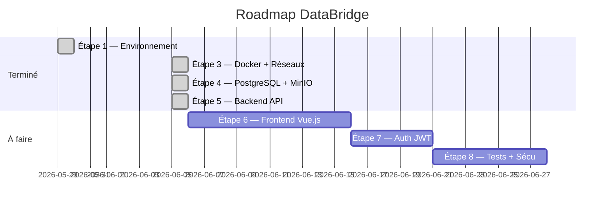
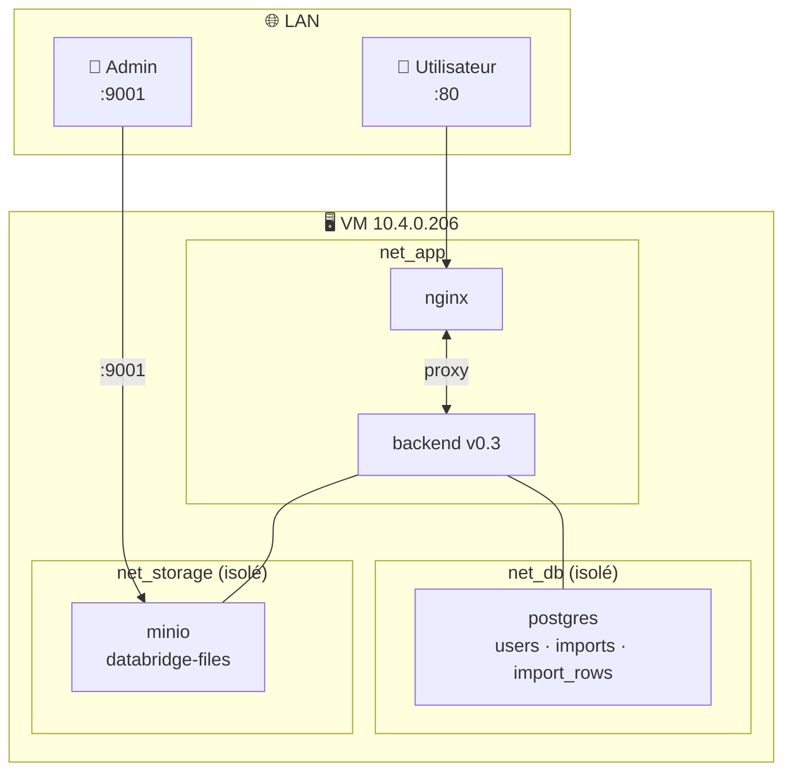
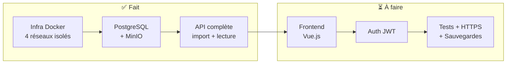

# DataBridge — Todo List & Suivi de projet

> Fichier partagé — modifiable par Yannis, Tommy et Claude Code.
> Cochez `[x]` quand c'est terminé. Ajoutez vos notes dans la section Notes en bas.

---

## Statut global

---

## Architecture en production

---

## ✅ Ce qui est fait

### Étape 1 — Préparation (2026-05-29)
- [x] Organisation GitHub `infoserv-DataBridge` + 2 repos
- [x] VM Proxmox (Debian 12, 10.4.0.206, Docker 29.5.2)
- [x] Structure dossiers + clés SSH GitHub

### Étape 3 — Infrastructure Docker (2026-06-05)
- [x] `docker-compose.yml` — 5 services orchestrés
- [x] 4 réseaux Docker isolés (net_db, net_storage, net_app, net_admin)
- [x] postgres / minio non accessibles depuis le LAN (internal: true)
- [x] nginx seul point d'entrée public (:80)

### Étape 4 — Base de données & stockage (2026-06-05)
- [x] Schéma PostgreSQL : `users`, `imports`, `import_rows` + index GIN
- [x] Bucket MinIO `databridge-files` (auto-créé)
- [x] `GET /api/health` — vérifie postgres + minio

### Étape 5 — Backend API (2026-06-05)
- [x] `POST /api/imports` — upload fichier + parse + stocke dans MinIO + insère en BDD
- [x] Parser Excel (`.xlsx`, `.xls`) via `xlsx`
- [x] Parser CSV via `csv-parser`
- [x] Insert en batch (100 lignes à la fois) pour les gros fichiers
- [x] `GET /api/imports` — liste tous les imports
- [x] `GET /api/imports/:id` — détail d'un import
- [x] `GET /api/imports/:id/rows` — données paginées (`?page=1&limit=50`)
- [x] Gestion erreurs : format invalide, fichier > 10 Mo, statut error en BDD

### Infrastructure & Docs
- [x] `docs/PROJET_COMPLET.md` — référence complète
- [x] `docs/secrets.enc` — credentials chiffrés AES-256 dans le repo
- [x] `docs/architecture.md` — schémas Mermaid (réseau, BDD, flux import)
- [x] `TODO.md` — ce fichier collaboratif
- [x] `infra-proxmox` — specs VM, réseau, journal

---

## ⏳ À faire

### Étape 6 — Frontend Vue.js
- [ ] Init projet Vue.js + Vite dans `frontend/`
- [ ] Page de connexion (login)
- [ ] Interface upload fichier (drag & drop)
- [ ] Tableau de visualisation des données importées
- [ ] Historique des imports avec statut
- [ ] Pagination des données

### Étape 7 — Authentification JWT
- [ ] `POST /api/auth/register` — inscription
- [ ] `POST /api/auth/login` — connexion → token JWT
- [ ] Middleware JWT — protection de toutes les routes `/api/imports`
- [ ] Gestion des rôles : `admin` / `user`
- [ ] Hashage mots de passe (`bcrypt`)

### Étape 8 — Tests, sécurisation, finalisation
- [ ] Tests API (Jest)
- [ ] HTTPS (certificat SSL)
- [ ] Sauvegardes automatiques PostgreSQL
- [ ] Limite upload 10 Mo visible côté frontend
- [ ] Documentation utilisateur final (non-techniciens)

---

## 🏗️ Progression

---

## 📝 Notes de l'équipe

> Ajoutez vos notes ici avec la date et votre prénom.

<!-- Exemple :
**2026-06-05 — Yannis :** J'ai testé l'upload CSV, ça fonctionne bien.
**2026-06-05 — Tommy :** Je commence le frontend demain.
-->
