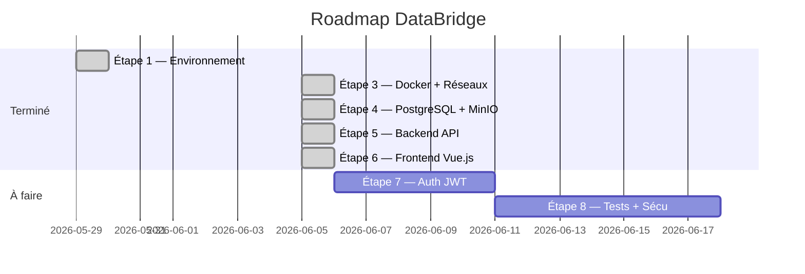
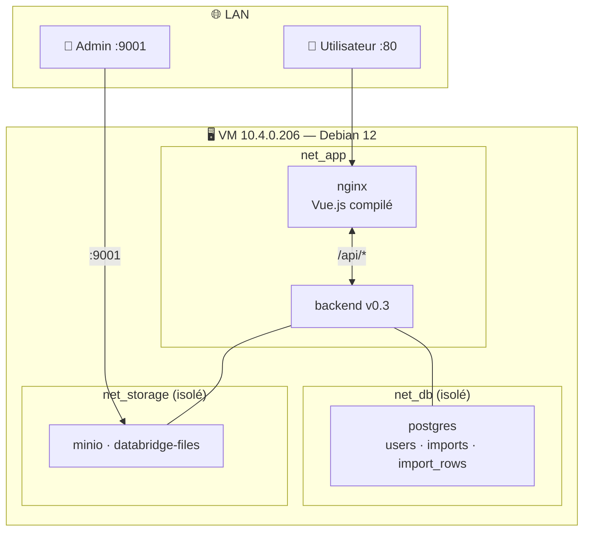

# DataBridge — Todo List & Suivi de projet

> Fichier partagé — modifiable par Yannis, Tommy et Claude.
> Cochez `[x]` quand c'est terminé. Ajoutez vos notes en bas.

---

## Statut global

---

## Application en production

---

## ✅ Ce qui est fait

### Étape 1 — Préparation (2026-05-29)
- [x] Organisation GitHub + 2 repos
- [x] VM Proxmox (Debian 12, Docker 29.5.2)
- [x] Structure dossiers + clés SSH

### Étape 3 — Infrastructure Docker (2026-06-05)
- [x] `docker-compose.yml` — 5 services
- [x] 4 réseaux Docker isolés (net_db, net_storage, net_app, net_admin)
- [x] Segmentation : postgres/minio non accessibles LAN

### Étape 4 — BDD & stockage (2026-06-05)
- [x] Schéma PostgreSQL : `users`, `imports`, `import_rows` + index GIN
- [x] Bucket MinIO `databridge-files` auto-créé

### Étape 5 — Backend API (2026-06-05)
- [x] `POST /api/imports` — upload + parse + MinIO + PostgreSQL
- [x] Parseurs Excel (xlsx) et CSV (csv-parser)
- [x] `GET /api/imports` — liste
- [x] `GET /api/imports/:id` — détail
- [x] `GET /api/imports/:id/rows` — données paginées

### Étape 6 — Frontend Vue.js (2026-06-05)
- [x] Vue.js 3 + Vite + Vue Router
- [x] Page import : drag & drop + upload + résultat
- [x] Page liste imports : tableau avec statut
- [x] Page détail : données tabulaires paginées
- [x] CSS responsive minimal (sans framework)
- [x] Build Docker multi-stage (Node.js → nginx)

### Infrastructure & Docs
- [x] `docs/PROJET_COMPLET.md` — référence complète
- [x] `docs/secrets.enc` — credentials chiffrés AES-256
- [x] `TODO.md` — ce fichier collaboratif
- [x] `infra-proxmox` — docs VM, réseau, journal

---

## ⏳ À faire

### Étape 7 — Authentification JWT
- [ ] `POST /api/auth/register` — inscription
- [ ] `POST /api/auth/login` — connexion → token JWT
- [ ] Middleware JWT sur toutes les routes `/api/imports`
- [ ] Page login Vue.js
- [ ] Stockage token (localStorage) + déconnexion
- [ ] Gestion des rôles : `admin` / `user`
- [ ] Hashage mots de passe (`bcrypt`)

### Étape 8 — Tests, sécurisation, finalisation
- [ ] Tests API (Jest)
- [ ] HTTPS (certificat SSL)
- [ ] Sauvegardes automatiques PostgreSQL
- [ ] Documentation utilisateur final
- [ ] Revue sécurité

---

## 📝 Notes de l'équipe

> Ajoutez vos notes ici avec la date et votre prénom.
> Exemple : **2026-06-05 — Yannis :** J'ai testé l'upload, ça fonctionne.

<!-- Vos notes ici -->
