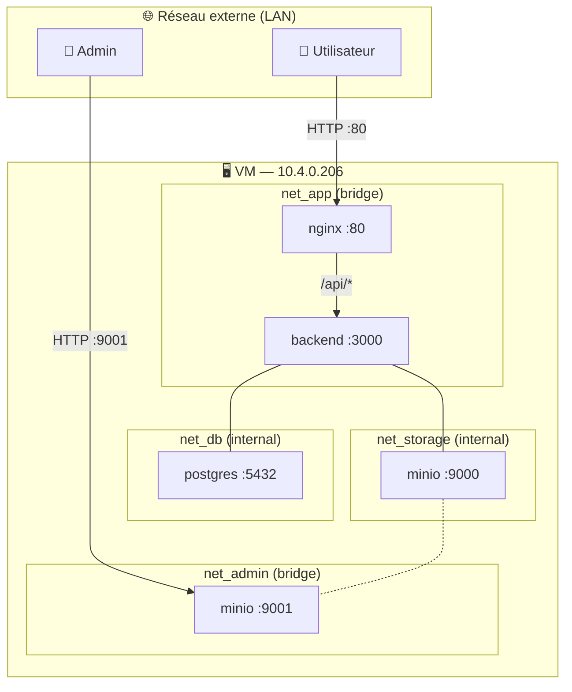
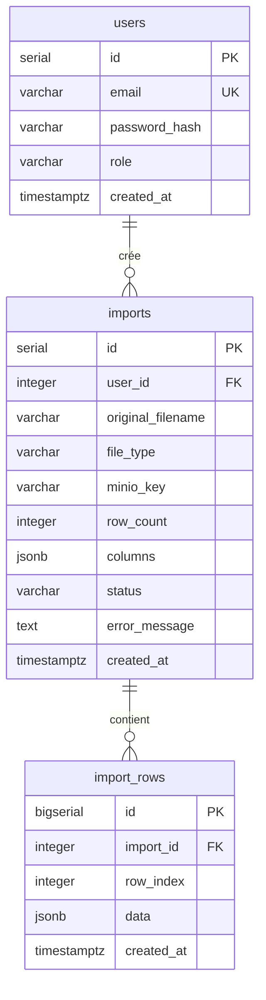
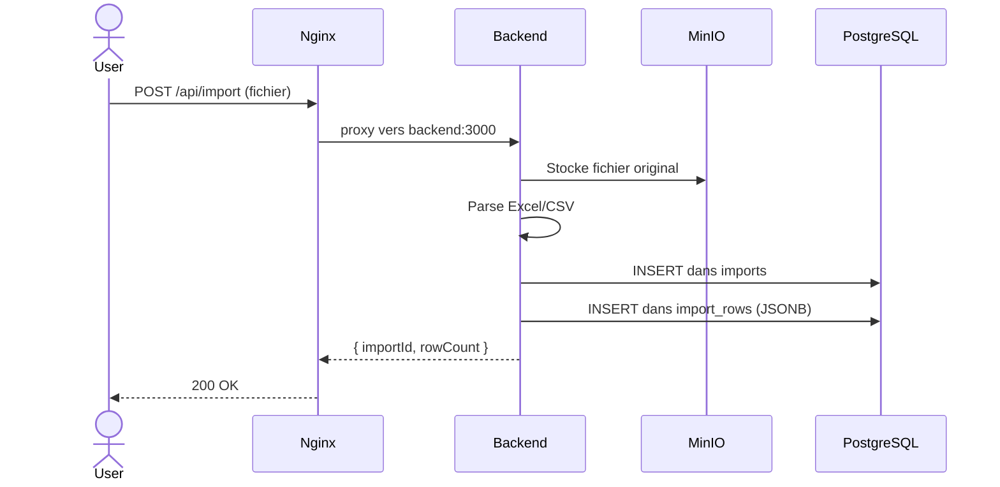

# Architecture technique — DataBridge

## Vue d'ensemble



## Segmentation réseau Docker

| Réseau | Type | Containers | Accès externe |
|--------|------|-----------|---------------|
| `net_db` | `internal: true` | postgres, backend | ❌ Impossible |
| `net_storage` | `internal: true` | minio, backend, minio-init | ❌ Impossible |
| `net_app` | bridge | nginx, backend | Via nginx:80 seulement |
| `net_admin` | bridge | minio | Console :9001 uniquement |

### Principe du moindre privilège

```
postgres  → UNIQUEMENT joignable par backend (net_db)
minio API → UNIQUEMENT joignable par backend (net_storage)
backend   → UNIQUEMENT joignable par nginx (net_app), aucun port exposé
nginx     → Seul point d'entrée public (port 80)
```

## Containers Docker

| Container | Image | Réseaux | Port exposé | Rôle |
|-----------|-------|---------|-------------|------|
| `databridge_postgres` | postgres:16-alpine | net_db | aucun | BDD |
| `databridge_minio` | minio/minio:latest | net_storage, net_admin | :9001 | Stockage |
| `databridge_minio_init` | minio/mc | net_storage | aucun | Init bucket |
| `databridge_backend` | node:20-alpine | net_db, net_storage, net_app | aucun | API REST |
| `databridge_nginx` | nginx:alpine | net_app | :80 | Reverse proxy |

## Schéma BDD



## Flux d'import d'un fichier



## Volumes persistants

| Volume | Données | Survit au `down` |
|--------|---------|-----------------|
| `databridge_postgres_data` | Tables PostgreSQL | ✅ Oui |
| `databridge_minio_data` | Fichiers stockés | ✅ Oui |

> Pour tout effacer : `docker compose down -v` (irréversible)

## Accès admin PostgreSQL (via SSH tunnel)

Postgres n'est pas exposé directement. Pour y accéder avec un outil graphique :

```bash
# Créer un tunnel SSH depuis votre machine locale
ssh -i ~/.ssh/proxmox -L 5432:localhost:5432 databridge@10.4.0.206

# Puis connecter votre outil (DBeaver, TablePlus...) sur localhost:5432
# OU directement via docker exec sur la VM :
docker exec -it databridge_postgres psql -U databridge_user -d databridge
```
